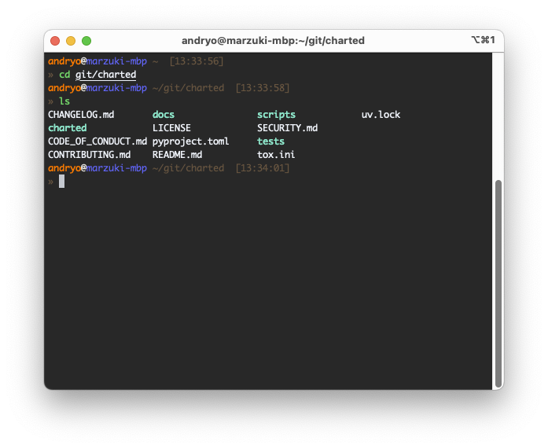
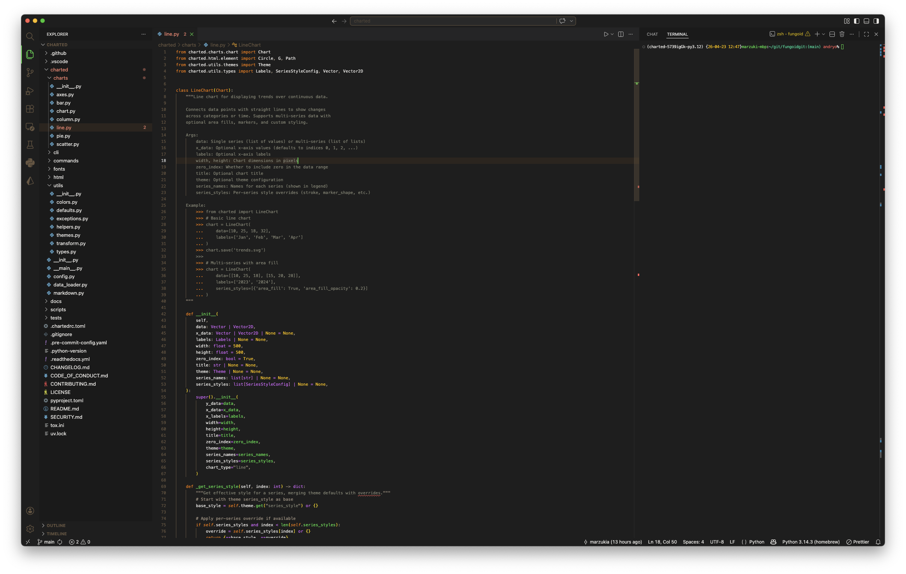

# 

A dark terminal and editor theme with orange (#ff7800) and green (#3cdc50) as dominant brand colors. Designed for developers who want a cohesive aesthetic across their entire development environment.

## Screenshots




## Features

- **Cohesive Design**: Matching themes for iTerm2, Oh My Zsh, and VSCode
- **Dracula-Inspired Syntax**: Clear, readable syntax highlighting with custom color palette
- **Optimized Performance**: Lightweight theme files with no redundant definitions
- **Git Integration**: Visual git status indicators in the prompt
- **Timestamp Display**: Green timestamp for easy command tracking
- **Exit Code Indicators**: Red indicators for failed commands
- **Custom Font Support**: Works with any monospace font, optimized for Nerd Fonts

## Color Palette

| Role | Hex Code | Usage |
|------|----------|-------|
| **Primary Orange** | `#ff7800` | Prompts, keywords, highlights |
| **Primary Green** | `#3cdc50` | Timestamps, success, strings |
| **Pink** | `#d966ff` | Types, classes |
| **Cyan** | `#00d296` | Accents, decorations |
| **Purple** | `#a855f7` | Operators |
| **Muted Grey** | `#a09080` | Comments, punctuation, paths |
| **Yellow** | `#ffbe00` | Secondary highlights |
| **Red** | `#ff5a5a` | Errors, warnings |
| **Background** | `#1e1e1e` | Dark background |
| **Foreground** | `#e8e6e3` | Primary text |

## Install

### iTerm2

1. Download [Fungoid.itermcolors](https://raw.githubusercontent.com/marzukia/fungoid/main/iterm/Fungoid.itermcolors)
2. Open iTerm2 Preferences > Profiles > Colors
3. Click "Color Presets..." > "Import..."
4. Select the downloaded file
5. Apply the theme to your profile

Detailed guide: [INSTALL.md#iterm2](INSTALL.md#iterm2)

### Oh My Zsh

1. Clone the repo:
```bash
git clone https://github.com/marzukia/fungoid.git ~/.oh-my-zsh/custom/themes/fungoid
```

2. Add `fungoid` to your `ZSH_THEME` in `~/.zshrc`:
```bash
ZSH_THEME="fungoid"
```

3. Reload your shell:
```bash
exec zsh
```

Detailed guide: [INSTALL.md#oh-my-zsh](INSTALL.md#oh-my-zsh)

### VSCode

1. Download the latest `.vsix` file from [releases](https://github.com/marzukia/fungoid/releases)
2. In VSCode: `Ctrl+Shift+P` > "Extensions: Install from VSIX"
3. Select the downloaded `.vsix` file
4. Press `Ctrl+K Ctrl+T` and select "Fungoid"

Alternative: Install from the [VSCode Marketplace](https://marketplace.visualstudio.com/items?itemName=marzukia.fungoid-theme)

Detailed guide: [../vscode/fungoid-vscode-theme/README.md](../vscode/fungoid-vscode-theme/README.md)

## Prompt Features

The Oh My Zsh theme provides:

- **Timestamp**: Green time display (HH:MM:SS format)
- **User@Host**: Orange username and hostname
- **Path**: Muted grey current directory with git branch
- **Git Status**: 
  - Teal for staged changes
  - Orange for modified files
  - Red for untracked files
- **Exit Code**: Red indicator on command failure
- **Prompt Glyphs**: Custom arrow glyphs (requires Nerd Font)

## Documentation

- [Installation Guide](INSTALL.md)
- [Color Palette](COLORS.md)
- [Color Channels](channels.md)
- [Contributing](CONTRIBUTING.md)
- [Changelog](CHANGELOG.md)

## Development

### Structure

```
fungoid/
├── iterm/                    # iTerm2 color scheme
│   └── Fungoid.itermcolors
├── oh-my-zsh/custom/themes/  # Zsh prompt theme
│   └── fungoid.zsh-theme
├── vscode/fungoid-vscode-theme/  # VSCode extension
│   ├── themes/fungoid.json
│   ├── package.json
│   └── README.md
├── docs/                     # Documentation
│   └── channels.md           # Channel setup guides
├── assets/                   # Logos and branding
├── screenshots/              # Theme screenshots
├── CHANGELOG.md              # Version history
├── CONTRIBUTING.md           # Contribution guidelines
├── INSTALL.md                # Detailed installation
└── LICENSE                   # MIT License
```

### Testing

After making changes:

1. **iTerm**: Import the `.itermcolors` file and test with various commands
2. **Zsh**: Copy to `~/.oh-my-zsh/custom/themes/` and test git operations
3. **VSCode**: Run `vsce package` and install with `code --install-extension`

## Channel Setup

Set up discord, telegram, or nostr integration: [channels.md](channels.md)

## Contributing

Contributions are welcome! See [CONTRIBUTING.md](CONTRIBUTING.md) for guidelines.

## Changelog

See [CHANGELOG.md](CHANGELOG.md) for version history.

## License

MIT License - see [LICENSE](LICENSE) for details.

## Related Projects

- [Fungoid TUI](https://github.com/marzukia/fungoid) - The underlying terminal application
- [Dracula Theme](https://draculatheme.com) - Inspiration for syntax highlighting philosophy
